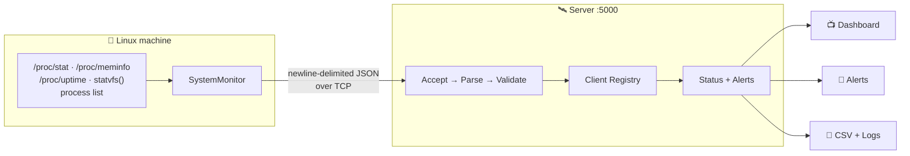
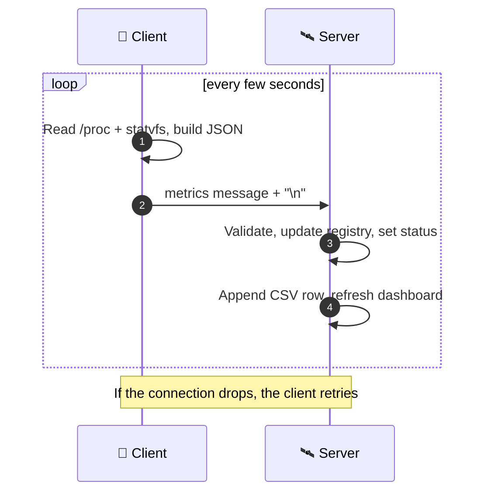
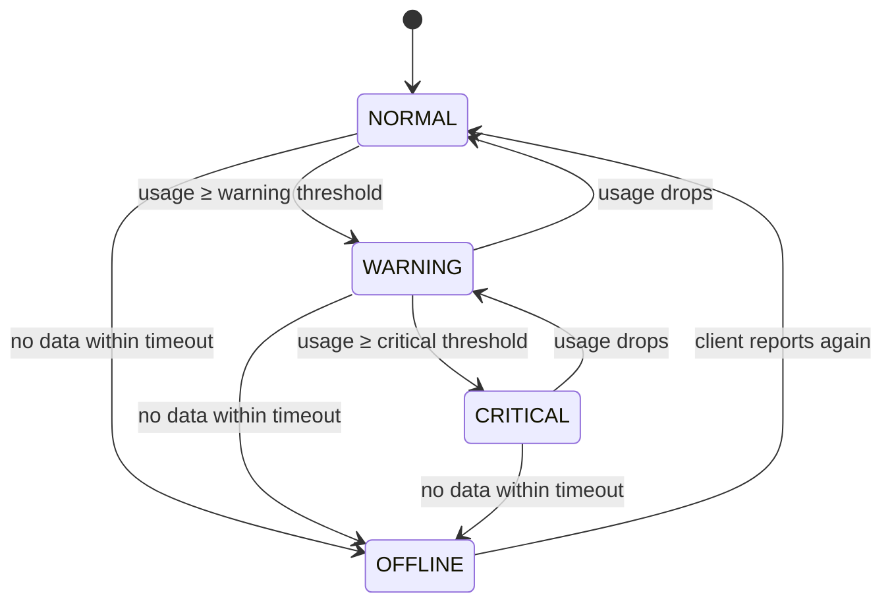

# Linux Resource Monitoring System

A lightweight, client-server monitoring tool for Linux. The client reads real-time resource usage directly from the operating system for minimal overhead and streams the data to a central server. The server aggregates this telemetry to provide a live terminal dashboard, automated anomaly alerts, and historical CSV logging.

[Live Terminal Preview](#%EF%B8%8F-dashboard-preview) • [Features](#-key-features) • [Architecture](#-how-it-works) • [Wire Protocol](#-wire-protocol) • [Quick Start](#-quick-start) • [Project Structure](#-project-structure) • [Testing & Resilience](#-testing--resilience-matrix) • [Future Roadmap](#%EF%B8%8F-future-roadmap)

---

## 🔭 Overview

The **Linux Resource Monitoring System** is a distributed, client-server monitoring solution developed entirely from scratch in modern C++17. Instead of relying on heavy external runtime frameworks, it achieves ultra-low-overhead observability by interfacing directly with the Linux kernel and utilizing raw TCP sockets.

- **The Client Daemon:** A lightweight agent running on monitored Linux nodes. It generates a persistent hardware identity and directly probes kernel pseudo-filesystems (`/proc/stat`, `/proc/meminfo`, `/proc/uptime`, `statvfs`) to compute real-time metrics without any costly subshell forks.
- **The Central Server:** A concurrent TCP server that aggregates telemetry from across the fleet. It performs NDJSON stream reassembly and strict payload validation, maintains client heartbeat states, evaluates multi-tier anomaly thresholds, and drives both a live terminal dashboard and persistent CSV auditing.



---

## 🖥️ Dashboard Preview

```text
==============================================
           LINUX SYSTEM MONITOR
==============================================

Client ID      Hostname       CPU %     Memory %    Disk %    Processes   Status
--------------------------------------------------------------------------
PC-945742      Ubuntu         24.2      70.7        34.1      310         WARNING

--------------------------------------------------------------------------
Total Clients: 1
Dashboard refresh interval: 2 seconds
```

---

## ⚡ Key Features

| Domain | Capability | Description |
| :--- | :--- | :--- |
| **System Probing** | Direct Kernel Telemetry | Interrogates `/proc/stat`, `/proc/meminfo`, `/proc/uptime`, and `statvfs()` directly without subshell forks or external CLI overhead. |
| **Networking** | Stream-Framed TCP | Transmits telemetry across raw TCP sockets using newline-delimited JSON (`\n`), ensuring zero message boundary corruption. |
| **Identity** | Persistent Host ID | Generates deterministic, persistent hardware identities via hashing machine-level signatures. |
| **Validation** | Defensive Ingestion | Validates range boundaries (0.0% - 100.0%), timestamp sanity, and JSON structure. Malformed frames are cleanly dropped without server fault. |
| **Alerting** | Tri-Tier Thresholding | Real-time threshold classification: `NORMAL` (Healthy), `WARNING` (>70%), `CRITICAL` (>90%), and `OFFLINE` (Heartbeat timeout). |
| **Observability** | Dual Output Engine | Live interactive ANSI terminal dashboard for operators alongside persistent CSV history for time-series auditing. |
| **Fault Tolerance** | Automatic Reconnect | Built-in backoff reconnection logic on connection loss; graceful server termination handling via SIGINT/Ctrl+C. |

---

## 🔬 How It Works



| 💡 Decision | 🎯 Why |
|---|---|
| **CPU % from two `/proc/stat` samples** | Counters are cumulative: `(Δtotal − Δidle) / Δtotal × 100`. |
| **`MemAvailable`, not `MemFree`** | `MemFree` ignores reclaimable cache and overstates usage. |
| **Newline-delimited JSON** | TCP has no message boundaries; `\n` gives simple framing. |
| **Server never trusts input** | Messages are parsed and range-checked before touching state. |
| **~15 s heartbeat timeout** | A silent client is marked `OFFLINE`. |

---

## 🚦 Status Logic



The rule applies to CPU, memory and disk, and `AlertManager` tracks state transitions. Active thresholds are currently set directly in `Server.cpp`.

---

## 📦 Wire Protocol

One JSON object per line, terminated by `\n`:

```json
{
    "type": "metrics", "client_id": "PC-945742", "hostname": "Ubuntu",
    "kernel_version": "7.0.0-38-generic",
    "cpu_usage": 3.53, "memory_usage": 70.68, "disk_usage": 34.09,
    "process_count": 310, "uptime_seconds": 5996.45, "timestamp": 1791042240
}
```

🛡️ **Rejected, not crashed on:** missing fields · malformed JSON · invalid values · out-of-range values (e.g. `"cpu_usage": 500`) · invalid client messages.

---

## 🚀 Quick Start

> [!TIP]
> Needs a Linux machine with `g++` and `make`. Defaults to `127.0.0.1:5000`.

```bash
sudo apt update && sudo apt install build-essential nlohmann-json3-dev netcat-openbsd
git clone https://github.com/JeevandeepRout/Linux-Resource-Monitoring-System.git
cd Linux-Resource-Monitoring-System
make                  # also: make client | make server | make clean | make test

./build/server        # Terminal 1
./build/client        # Terminal 2, then watch the server dashboard 🎉
```

---

## 📂 Project Structure

```text
linux-resource-monitoring-system/
│
├── client/                     # Client daemon source files
│   ├── ClientIdentity.cpp      # Persistent hardware identity generator
│   ├── ClientIdentity.h
│   ├── NetworkClient.cpp       # POSIX TCP client socket implementation
│   ├── NetworkClient.h
│   ├── SystemMonitor.cpp       # Kernel telemetry collector (/proc, statvfs)
│   ├── SystemMonitor.h
│   └── main.cpp                # Client executable entry point
│
├── server/                     # Central telemetry server source files
│   ├── AlertManager.cpp        # Threshold classifier (NORMAL/WARN/CRIT)
│   ├── AlertManager.h
│   ├── ClientRegistry.cpp      # In-memory fleet tracking & heartbeat manager
│   ├── ClientRegistry.h
│   ├── ClientState.h           # Per-client state data structures
│   ├── CsvLogger.cpp           # Historical CSV metrics persistence
│   ├── CsvLogger.h
│   ├── Dashboard.cpp           # Real-time ANSI terminal dashboard (TUI)
│   ├── Dashboard.h
│   ├── Logger.cpp              # System event logging engine
│   ├── Logger.h
│   ├── Server.cpp              # TCP listener, NDJSON deframer & event loop
│   ├── Server.h
│   ├── main.cpp                # Server executable entry point
│   ├── test_csv.cpp            # CSV persistence test runner
│   ├── test_dashboard.cpp      # Dashboard rendering test harness
│   └── test_logger.cpp         # Event logger test harness
│
├── common/                     # Shared cross-boundary components
│   ├── Config.h                # Configuration data structures
│   ├── ConfigLoader.cpp        # JSON configuration parser
│   ├── ConfigLoader.h
│   ├── SystemData.h            # Telemetry model & JSON serialization
│   └── test_config.cpp         # ConfigLoader test harness
│
├── config/                     # Configuration definitions
│   └── config.json             # Fleet defaults & threshold rules
│
├── tests/                      # Automated test suite
│   ├── test_metrics.cpp        # Unit tests for kernel metric sampling
│   └── test_protocol.cpp       # Unit tests for NDJSON protocol integrity
│
├── logs/                       # Application runtime data & history
│   ├── metrics.csv             # Structured CSV time-series log
│   └── server.log              # Human-readable operational event log
│
├── build/                      # Build output artifacts directory
├── Makefile                    # Multi-target GNU build script
├── .gitignore                  # Git tracking exclusion rules
└── README.md                   # Comprehensive project documentation
```

---

## 🧪 Testing & Resilience Matrix

The project underwent an 8-stage verification procedure to guarantee low latency, mathematical accuracy, and crash resistance against corrupted network payloads:

```bash
# Execute automated test suite
make test
```

**Verification Test Summary:**

```text
[TEST 1] System Metrics Validation ............................. [PASSED]
[TEST 2] NDJSON Protocol Serialization ......................... [PASSED]
[TEST 3] Out-of-Bounds Injection Defense ....................... [PASSED]
[TEST 4] State Transition & Alerting ........................... [PASSED]
[TEST 5] CSV Time-Series Persistence ........................... [PASSED]
[TEST 6] Broken Pipe Recovery & Auto-Reconnect ................. [PASSED]
[TEST 7] POSIX Signal Graceful Teardown (SIGINT) ............... [PASSED]
[TEST 8] Multi-Client Concurrency Stress ....................... [PASSED]
```

| # | Test Category | Injection / Scenario | Verification Outcome |
| :--- | :--- | :--- | :--- |
| **1** | Metric Sampling | Query live `/proc` counters on active Linux host | Verified CPU (0-100%), Memory (0-100%), Disk (0-100%), and PID count are numerically authentic and within physiological constraints. |
| **2** | Protocol Serialization | Encode `SystemData` to NDJSON and deserialize | Byte-for-byte serialization match; field types and precision preserved across parse cycles. |
| **3** | Defensive Fuzzing | Injected malformed JSON strings, partial packets, and out-of-range metrics | Server rejected invalid payloads with descriptive log alerts; zero crashes, memory leaks, or unhandled exceptions. |
| **4** | Dynamic Alerting | Injected artificially spiked CPU loads (>90%) | Server immediately transitioned node state from `NORMAL` ➔ `CRITICAL` in dashboard and logged alert timestamp. |
| **5** | Storage Persistence | Restarted server across active client monitoring sessions | `logs/metrics.csv` retained full audit continuity without truncation or header corruption. |
| **6** | Auto-Reconnection | Server forcibly terminated while client active | Client detected socket closure, entered retry backoff, and automatically resumed streaming the instant server restarted. |
| **7** | Graceful Teardown | Sent SIGINT (`Ctrl+C`) to running server & client | Sockets unlinked, connection buffers flushed, open files closed without file descriptor leaks. |
| **8** | Process Concurrency | 5 independent client processes spawned simultaneously | Linux scheduler verified 5 concurrent threads; server successfully aggregated all inbound TCP sockets. |

---

## 🗺️ Future Roadmap

- [ ] **Dynamic Configuration**: Wire `ConfigLoader` into live server state to allow dynamic threshold updates without recompilation.
- [ ] **Transport Security**: Integrate OpenSSL / TLS 1.3 encryption with client-side mutual TLS (mTLS) authentication.
- [ ] **Database Persistence**: Introduce an embedded SQLite storage engine with automated retention.
- [ ] **Web Dashboard**: Build a lightweight, responsive WebSocket-driven web UI.

---

<div align="center">

*A hands-on deep dive into Linux system programming, C++ networking and monitoring architecture.*

⭐ If this project helped or interested you, consider giving it a star!

<br>

<a href="https://github.com/JeevandeepRout/Linux-Resource-Monitoring-System/issues">Report Bug</a> •
<a href="https://github.com/JeevandeepRout/Linux-Resource-Monitoring-System/issues">Request Feature</a>

</div>
