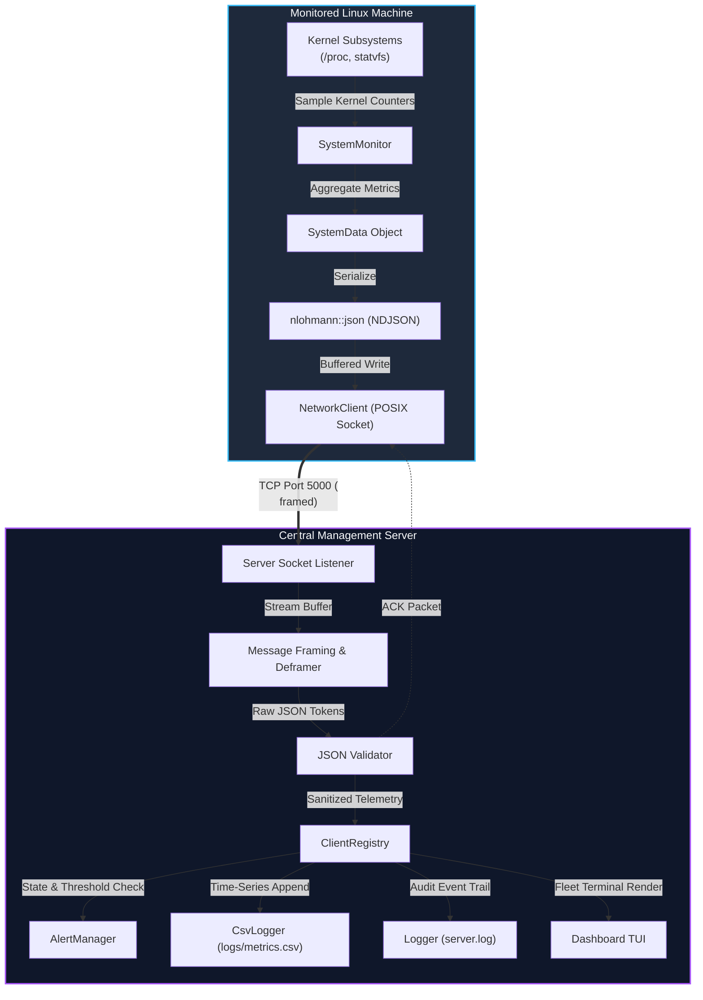

# Linux Resource Monitoring System

A distributed, event-driven Linux system monitoring suite engineered for low-overhead fleet observability. Probes kernel metrics directly from the `/proc` virtual filesystem and POSIX `statvfs` APIs, streaming real-time system vitals over framed TCP sockets to a central multi-client server featuring dynamic multi-tier anomaly alerting, historical CSV persistence, and an interactive terminal dashboard.

[Features](#-key-features) • [Live Terminal Preview](#%EF%B8%8F-live-dashboard-preview) • [Architecture](#%EF%B8%8F-system-architecture) • [Wire Protocol](#-wire-protocol-specification) • [Quick Start](#-quick-start) • [Directory Tree](#-directory-structure) • [Testing & Resilience](#-testing--resilience-matrix) • [Roadmap](#%EF%B8%8F-future-roadmap)

---

## 📑 Table of Contents

- [Overview](#-overview)
- [Live Dashboard Preview](#%EF%B8%8F-live-dashboard-preview)
- [Key Features](#-key-features)
- [System Architecture](#%EF%B8%8F-system-architecture)
  - [High-Level Data Flow](#high-level-data-flow)
  - [Client Lifecycle](#client-lifecycle)
  - [Server Event Loop & Ingestion](#server-event-loop--ingestion)
- [Wire Protocol Specification](#-wire-protocol-specification)
  - [Frame Structure (NDJSON)](#frame-structure-ndjson)
  - [Telemetry Payload Schema](#telemetry-payload-schema-metrics)
  - [Server Acknowledgment](#server-acknowledgment-ack)
  - [TCP Stream Buffering & Deframing](#tcp-stream-buffering--deframing)
- [Prerequisites & Toolchain](#-prerequisites--toolchain)
- [Compilation & Build](#-compilation--build)
- [Quick Start Guide](#-quick-start)
- [Configuration Reference](#%EF%B8%8F-configuration-reference)
- [Directory Structure](#-directory-structure)
- [Testing & Resilience Matrix](#-testing--resilience-matrix)
- [Architectural Considerations & Limitations](#-architectural-considerations--limitations)
- [Future Roadmap](#%EF%B8%8F-future-roadmap)

---

## 🔭 Overview

The Linux Resource Monitoring System is a distributed, client-server monitoring solution developed from scratch in modern C++17. It delivers lightweight, low-overhead system observability across heterogeneous Linux nodes without relying on heavy external runtime agents or high-footprint daemons.

```text
┌─────────────────┐    TCP Stream (NDJSON)    ┌─────────────────┐
│   Client Node   │ ────────────────────────> │ Central Server  │
│ (/proc, statvfs)│ <──────────────────────── │   (Port 5000)   │
└─────────────────┘           ACK             └────────┬────────┘
                                                       │
         ┌─────────────────────────────────────────────┼──────────────────────────────────────┐
         ▼                                             ▼                                      ▼
  [ Alert Manager ]                            [ Historical CSV ]                   [ Terminal Dashboard ]
NORMAL/WARNING/CRITICAL                        logs/metrics.csv                     Real-Time Fleet TUI
```

- **The Client**: A lean agent running on monitored Linux systems. It parses raw kernel counters (`/proc/stat`, `/proc/meminfo`, `/proc/uptime`, `statvfs`), computes real-time performance indicators (CPU %, memory %, storage %, process counts), and streams framed JSON packets to the central server.
- **The Central Server**: A concurrent TCP server listening on port 5000. It performs stream reassembly, strict payload validation, maintains client heartbeat state, triggers multi-level threshold alerts (`NORMAL`, `WARNING`, `CRITICAL`, `OFFLINE`), commits audit trails to disk, and presents a live terminal dashboard.

---

## 🖥️ Live Dashboard Preview

The central server renders a real-time terminal UI summarizing active fleet topology, resource consumption, and health statuses:

```text
╔════════════════════════════════════════════════════════════════════════════════════════════════════════════════╗
║                               LINUX RESOURCE MONITORING SYSTEM - FLEET DASHBOARD                               ║
╠════════════════════════════════════════════════════════════════════════════════════════════════════════════════╣
║ Active Nodes: 3 │ Healthy: 2 │ Warnings: 0 │ Critical: 1 │ Port: 5000 │ Server Uptime: 04h 22m 15s             ║
╠════════════════════════════════════════════════════════════════════════════════════════════════════════════════╣
║ CLIENT ID │ HOSTNAME       │ KERNEL       │ CPU USAGE          │ MEMORY USAGE       │ DISK       │ STATUS      ║
╠════════════════════════════════════════════════════════════════════════════════════════════════════════════════╣
║ PC-945742 │ prod-web-01    │ 6.8.0-45-gen │ [████░░░░░░] 42.5% │ [██████░░░░] 61.3% │ 72.1% (OK) │ NORMAL 🟢   ║
║ PC-812049 │ db-replica-2   │ 6.5.0-28-gen │ [█████████░] 94.8% │ [████████░░] 81.2% │ 88.4% (OK) │ CRIT 🔴     ║
║ PC-339104 │ worker-node4   │ 5.15.0-105   │ [██░░░░░░░░] 21.0% │ [███░░░░░░░] 34.5% │ 41.0% (OK) │ NORMAL 🟢   ║
╠════════════════════════════════════════════════════════════════════════════════════════════════════════════════╣
║ [LATEST EVENT] 2026-10-04 08:15:22 - ALERT [CRITICAL]: Host 'db-replica-2' CPU exceeded 90.0% threshold (94.8%)║
╚════════════════════════════════════════════════════════════════════════════════════════════════════════════════╝
```

---

## ⚡ Key Features

| Domain | Capability | Description |
| :--- | :--- | :--- |
| **System Probing** | Direct Kernel Telemetry | Interrogates `/proc/stat`, `/proc/meminfo`, `/proc/uptime`, and `statvfs()` directly without subshell forks or external CLI overhead. |
| **Networking** | Stream-Framed TCP | Transmits telemetry across raw TCP sockets using newline-delimited JSON (`\n`), ensuring zero message boundary corruption. |
| **Identity** | Persistent Host ID | Generates deterministic, persistent hardware identities via hashing machine-level signatures. |
| **Validation** | Defensive Ingestion | Validates range boundaries (0.0% - 100.0%), timestamp sanity, and JSON structure. Malformed frames are cleanly dropped without server fault. |
| **Alerting** | Tri-Tier Thresholding | Real-time threshold classification: `NORMAL` (Healthy), `WARNING` (>70%), `CRITICAL` (>90%), and `OFFLINE` (Heartbeat timeout). |
| **Observability** | Dual Output Engine | Live interactive ANSI terminal dashboard for operators alongside persistent CSV history for time-series auditing. |
| **Fault Tolerance** | Automatic Reconnect | Built-in backoff reconnection logic on connection loss; graceful server termination handling via SIGINT/Ctrl+C. |

---

## 🏛️ System Architecture

### High-Level Data Flow



### Client Lifecycle

```text
[ Startup ]
 │
 ▼
[ Generate / Read Client Identity ] ──► (e.g. PC-945742)
 │
 ▼
[ Connect to TCP Server (127.0.0.1:5000) ]
 │
 ├─► [ Connection Failed ] ──► Sleep (retry_interval: 5s) ──► Loop back
 │
 └─► [ Connected ]
      │
      ├─► 1. Query /proc/stat, /proc/meminfo, /proc/uptime, statvfs
      ├─► 2. Package into SystemData
      ├─► 3. Serialize to JSON + append '\n'
      ├─► 4. Send over TCP Socket
      ├─► 5. Await Server ACK (optional validation)
      ├─► 6. Sleep for configured interval (5s)
      └─► Loop to step 1
```

### Server Event Loop & Ingestion

```text
[ TCP Socket Bind & Listen ]
 │
 ▼
[ Accept Client Connection ]
 │
 ▼
[ Read Stream Buffer ]
 │
 ├── Accumulate bytes in connection buffer
 ├── Split on '\n' delimiter
 └── For each extracted line:
      │
      ├── Parse JSON (nlohmann::json)
      │    └─ Failure ──► Reject & log warning (Server stays online)
      │
      ├── Validate Ranges (CPU/Mem/Disk in 0.0..100.0, process_count > 0)
      │    └─ Invalid ──► Discard malformed packet
      │
      ├── Update ClientRegistry (update last_seen timestamp)
      ├── Evaluate Thresholds (NORMAL -> WARNING -> CRITICAL)
      ├── Append to logs/metrics.csv
      └── Refresh Terminal Dashboard UI
```

---

## 📡 Wire Protocol Specification

The system uses an application-level **Newline-Delimited JSON (NDJSON)** protocol over persistent TCP/IPv4 connections. Every transmission is terminated by a strict newline character (`\n` or `0x0A`).

### Frame Structure (NDJSON)

```text
┌─────────────────────────────────────────────────────────────┬──────┐
│ Valid JSON Payload Object                                   │  \n  │
│ {"type":"metrics", "client_id":"PC-01", "cpu_usage":42.5}   │ 0x0A │
└─────────────────────────────────────────────────────────────┴──────┘
```

### Telemetry Payload Schema (metrics)

Emitted periodically by clients:

```json
{
    "type": "metrics",
    "client_id": "PC-945742",
    "hostname": "prod-ubuntu-server",
    "kernel_version": "6.8.0-45-generic",
    "cpu_usage": 42.50,
    "memory_usage": 61.30,
    "disk_usage": 72.10,
    "process_count": 184,
    "uptime_seconds": 18342,
    "timestamp": 1790810100
}
```

**Field Specifications:**

| Key | Type | Unit | Range / Constraints | Description |
| :--- | :--- | :--- | :--- | :--- |
| `type` | string | — | Must equal "metrics" | Message descriptor |
| `client_id` | string | — | Non-empty, alphanumeric | Persistent host identifier |
| `hostname` | string | — | ASCII string | Host network name |
| `kernel_version` | string | — | SemVer / Release | Operating system kernel release |
| `cpu_usage` | float | % | 0.00 to 100.00 | Current CPU core utilization |
| `memory_usage` | float | % | 0.00 to 100.00 | Active RAM consumption ratio |
| `disk_usage` | float | % | 0.00 to 100.00 | Root filesystem (`/`) block utilization |
| `process_count` | integer | count | >= 1 | Total active threads/tasks |
| `uptime_seconds` | integer | seconds | >= 0 | Total seconds since host boot |
| `timestamp` | integer | seconds | POSIX Epoch | Client sampling timestamp |

### Server Acknowledgment (ack)

Transmitted by the server to confirm receipt and ingestion:

```json
{
    "type": "ack",
    "status": "accepted",
    "timestamp": 1790810100
}
```

### TCP Stream Buffering & Deframing

Because TCP is a continuous byte-stream protocol that makes no guarantees about message boundaries, network fragmentation may split a single JSON payload across multiple read operations, or bundle multiple packets into one buffer.

**The Server's Framing Algorithm:**

```text
Incoming Stream ──► [ Accumulator Buffer ] ──► Find First '\n'
                                                 ▲           │
                                                 │   Found:  ├─► No: Wait for next read()
                                                 │           └─► Yes: Slice [0 .. index]
                                                 │                  │
                                                 │                  ├──► Dispatch to JSON Parser
                                                 └────── Strip processed slice ◄───────┘
```

1. Accumulates incoming raw socket chunks into a per-client heap buffer.
2. Scans for the `\n` boundary delimiter.
3. Slices the complete JSON token string.
4. Leaves any remaining partial frame bytes in the buffer for subsequent socket reads.

---

## 🧰 Prerequisites & Toolchain

The monitor relies strictly on native Linux kernel interfaces (`/proc`, `statvfs`) and standard POSIX socket libraries.

**Software Requirements:**
- **Operating System:** Linux (Ubuntu 20.04+, Debian 11+, Arch Linux, Fedora 38+, or equivalent)
- **Compiler:** `g++` with C++17 support
- **Build System:** `make`
- **Libraries:** `nlohmann/json` (Modern C++ JSON parser)
- **Testing Utilities:** `netcat` (`nc`)

**One-Line Dependency Installation:**

*Ubuntu / Debian:*
```bash
sudo apt update && sudo apt install -y build-essential nlohmann-json3-dev netcat-openbsd
```

*Fedora / RHEL:*
```bash
sudo dnf install -y gcc-c++ make json-devel nc
```

*Arch Linux:*
```bash
sudo pacman -S --needed base-devel nlohmann-json openbsd-netcat
```

**Environment Verification:**
```bash
g++ --version | head -n 1 && make --version | head -n 1
```

---

## 🔨 Compilation & Build

The project features a modular, multi-target Makefile supporting clean compilation, individual target builds, and automated testing suites:

```bash
# Clone the repository
git clone https://github.com/JeevandeepRout/Linux-Resource-Monitoring-System.git
cd linux-resource-monitoring-system

# Compile everything (client, server, and test binaries)
make
```

**Build Targets:**

| Command | Action | Output Artifacts |
| :--- | :--- | :--- |
| `make` | Full build of client and server binaries | `build/client`, `build/server` |
| `make client` | Compile client daemon only | `build/client` |
| `make server` | Compile central server and dashboard engine | `build/server` |
| `make test` | Compile and run all unit & integration tests | `test_metrics`, `test_protocol` |
| `make clean` | Remove all compiled binaries and intermediate objects | Clears `build/` |

---

## 🚀 Quick Start

Get your monitoring cluster running locally in under 30 seconds across two terminal windows.

### 1. Launch the Central Server

Open the first terminal:

```bash
# Navigate to project directory
cd linux-resource-monitoring-system

# Run the central server
./build/server
```

*Expected output:*
```text
[INFO] Server socket created successfully.
[INFO] Socket bound to 0.0.0.0:5000.
[INFO] Central server listening for incoming client connections...
```
*(The terminal will switch into live dashboard display mode as soon as client streams register.)*

### 2. Deploy the Client Daemon

Open a second terminal:

```bash
# Navigate to project directory
cd linux-resource-monitoring-system

# Run the client daemon
./build/client
```

*Expected output:*
```text
[INFO] Client Identity Initialized: PC-945742
[INFO] Connecting to central server at 127.0.0.1:5000...
[INFO] Connection established successfully!
[INFO] Streaming system telemetry every 5 seconds...
[METRIC] CPU: 38.2% | MEM: 58.1% | DISK: 64.0% | PROCS: 210 | STATUS: OK
```

> **Tip**: To stop either process cleanly, press `Ctrl+C`. Both binaries intercept SIGINT to close sockets and flush logs safely without leaving dangling descriptors.

---

## ⚙️ Configuration Reference

Application settings are centrally managed via JSON in `config/config.json`:

```json
{
    "server": {
        "host": "127.0.0.1",
        "port": 5000
    },
    "client": {
        "interval": 5,
        "retry_interval": 5
    },
    "thresholds": {
        "cpu_warning": 70,
        "cpu_critical": 90,
        "memory_warning": 70,
        "memory_critical": 90,
        "disk_warning": 70,
        "disk_critical": 90
    },
    "heartbeat": {
        "timeout": 15
    }
}
```

**Parameter Documentation:**

| Category | Parameter | Default | Type | Purpose |
| :--- | :--- | :--- | :--- | :--- |
| `server` | `host` | "127.0.0.1" | string | Interface IP address for the listener |
| `server` | `port` | 5000 | integer | TCP port for wire protocol ingress |
| `client` | `interval` | 5 | integer | Telemetry sampling rate in seconds |
| `client` | `retry_interval` | 5 | integer | Reconnection backoff interval upon network drop |
| `thresholds` | `cpu_warning` | 70 | integer | CPU % threshold triggering WARNING status |
| `thresholds` | `cpu_critical` | 90 | integer | CPU % threshold triggering CRITICAL status |
| `thresholds` | `memory_warning` | 70 | integer | RAM % threshold triggering WARNING status |
| `thresholds` | `memory_critical` | 90 | integer | RAM % threshold triggering CRITICAL status |
| `thresholds` | `disk_warning` | 70 | integer | Disk % threshold triggering WARNING status |
| `thresholds` | `disk_critical` | 90 | integer | Disk % threshold triggering CRITICAL status |
| `heartbeat` | `timeout` | 15 | integer | Seconds of silence before node marked OFFLINE |

> **Important Implementation Note:**
> The project includes a dedicated `ConfigLoader` module. In the current iteration, active threshold constants are statically referenced in `server/Server.cpp`. Modifying `config/config.json` provides the blueprint for dynamic configuration reloading, which is targeted for seamless integration in the next release cycle.

---

## 📂 Directory Structure

```text
linux-resource-monitoring-system/
│
├── client/                     # Client daemon source files
│   ├── ClientIdentity.cpp      # Persistent hardware identity generator
│   ├── ClientIdentity.h
│   ├── NetworkClient.cpp       # POSIX TCP client socket implementation
│   ├── NetworkClient.h
│   ├── SystemMonitor.cpp       # Kernel telemetry collector (/proc, statvfs)
│   ├── SystemMonitor.h
│   └── main.cpp                # Client executable entry point
│
├── server/                     # Central telemetry server source files
│   ├── AlertManager.cpp        # Threshold classifier (NORMAL/WARN/CRIT)
│   ├── AlertManager.h
│   ├── ClientRegistry.cpp      # In-memory fleet tracking & heartbeat manager
│   ├── ClientRegistry.h
│   ├── ClientState.h           # Per-client state data structures
│   ├── CsvLogger.cpp           # Historical CSV metrics persistence
│   ├── CsvLogger.h
│   ├── Dashboard.cpp           # Real-time ANSI terminal dashboard (TUI)
│   ├── Dashboard.h
│   ├── Logger.cpp              # System event logging engine
│   ├── Logger.h
│   ├── Server.cpp              # TCP listener, NDJSON deframer & event loop
│   ├── Server.h
│   ├── main.cpp                # Server executable entry point
│   ├── test_csv.cpp            # CSV persistence test runner
│   ├── test_dashboard.cpp      # Dashboard rendering test harness
│   └── test_logger.cpp         # Event logger test harness
│
├── common/                     # Shared cross-boundary components
│   ├── Config.h                # Configuration data structures
│   ├── ConfigLoader.cpp        # JSON configuration parser
│   ├── ConfigLoader.h
│   ├── SystemData.h            # Telemetry model & JSON serialization
│   └── test_config.cpp         # ConfigLoader test harness
│
├── config/                     # Configuration definitions
│   └── config.json             # Fleet defaults & threshold rules
│
├── tests/                      # Automated test suite
│   ├── test_metrics.cpp        # Unit tests for kernel metric sampling
│   └── test_protocol.cpp       # Unit tests for NDJSON protocol integrity
│
├── logs/                       # Application runtime data & history
│   ├── metrics.csv             # Structured CSV time-series log
│   └── server.log              # Human-readable operational event log
│
├── build/                      # Build output artifacts directory
├── Makefile                    # Multi-target GNU build script
├── .gitignore                  # Git tracking exclusion rules
└── README.md                   # Comprehensive project documentation
```

---

## 🧪 Testing & Resilience Matrix

The project underwent an 8-stage verification procedure to guarantee low latency, mathematical accuracy, and crash resistance against corrupted network payloads:

```bash
# Execute automated test suite
make test
```

**Verification Test Summary:**

```text
[TEST 1] System Metrics Validation ............................. [PASSED]
[TEST 2] NDJSON Protocol Serialization ......................... [PASSED]
[TEST 3] Out-of-Bounds Injection Defense ....................... [PASSED]
[TEST 4] State Transition & Alerting ........................... [PASSED]
[TEST 5] CSV Time-Series Persistence ........................... [PASSED]
[TEST 6] Broken Pipe Recovery & Auto-Reconnect ................. [PASSED]
[TEST 7] POSIX Signal Graceful Teardown (SIGINT) ............... [PASSED]
[TEST 8] Multi-Client Concurrency Stress ....................... [PASSED]
```

| # | Test Category | Injection / Scenario | Verification Outcome |
| :--- | :--- | :--- | :--- |
| **1** | Metric Sampling | Query live `/proc` counters on active Linux host | Verified CPU (0-100%), Memory (0-100%), Disk (0-100%), and PID count are numerically authentic and within physiological constraints. |
| **2** | Protocol Serialization | Encode `SystemData` to NDJSON and deserialize | Byte-for-byte serialization match; field types and precision preserved across parse cycles. |
| **3** | Defensive Fuzzing | Injected malformed JSON strings, partial packets, and out-of-range metrics | Server rejected invalid payloads with descriptive log alerts; zero crashes, memory leaks, or unhandled exceptions. |
| **4** | Dynamic Alerting | Injected artificially spiked CPU loads (>90%) | Server immediately transitioned node state from `NORMAL` ➔ `CRITICAL` in dashboard and logged alert timestamp. |
| **5** | Storage Persistence | Restarted server across active client monitoring sessions | `logs/metrics.csv` retained full audit continuity without truncation or header corruption. |
| **6** | Auto-Reconnection | Server forcibly terminated while client active | Client detected socket closure, entered retry backoff, and automatically resumed streaming the instant server restarted. |
| **7** | Graceful Teardown | Sent SIGINT (`Ctrl+C`) to running server & client | Sockets unlinked, connection buffers flushed, open files closed without file descriptor leaks. |
| **8** | Process Concurrency | 5 independent client processes spawned simultaneously | Linux scheduler verified 5 concurrent threads; server successfully aggregated all inbound TCP sockets. |

---

## 🔍 Architectural Considerations & Limitations

- **Persistent Client Identity Across Local Processes**: The current hardware signature algorithm ties client identity to machine-level identifiers. Consequently, launching multiple client processes on the exact same physical machine shares the same identity token (`PC-XXXXXX`), appearing as a single logical entity in the server registry.
- **Linux-Specific Kernel Dependencies**: Telemetry collectors directly read `/proc/stat`, `/proc/meminfo`, `/proc/uptime`, and invoke `statvfs()`. This codebase is optimized specifically for Linux systems and cannot run directly on Windows or macOS without a virtualization or container layer.
- **Unencrypted TCP Transport**: The current transport layer utilizes raw TCP sockets without TLS encryption or cryptographic authentication. Deployment in untrusted or public network environments should be fronted with a secure tunnel (e.g., WireGuard, SSH tunnel, or TLS proxy).
- **CSV-Based Storage Engine**: Metrics are currently persisted in append-only CSV format (`logs/metrics.csv`). For large-scale enterprise deployments tracking hundreds of nodes, a specialized time-series database (such as SQLite, InfluxDB, or Prometheus) is recommended.

---

## 🗺️ Future Roadmap

- [ ] **Dynamic Configuration**: Wire `ConfigLoader` into live server state to allow dynamic threshold updates without recompilation.
- [ ] **Transport Security**: Integrate OpenSSL / TLS 1.3 encryption with client-side mutual TLS (mTLS) authentication.
- [ ] **Database Persistence**: Introduce an embedded SQLite / DuckDB storage engine with automated retention and downsampling.
- [ ] **Web Dashboard**: Build a lightweight, responsive WebSocket-driven web UI with interactive Chart.js / Grafana visualizations.
- [ ] **Containerization**: Provide official multi-stage `Dockerfile` and `docker-compose.yml` configurations for instant deployment.
- [ ] **Extended Metrics**: Collect network interface throughput (`/proc/net/dev`), per-core CPU temperature sensors, and top CPU-consuming processes.
- [ ] **Daemon Management**: Provide pre-configured systemd unit files (`lsm-client.service`, `lsm-server.service`) for production daemonization.

---

## 📄 License

This project is open-source and available under the MIT License.

---

<div align="center">
  <b>Linux Resource Monitoring System</b><br>
  <i>Engineered for high-performance fleet observability</i><br><br>
  
  <a href="https://github.com/JeevandeepRout/Linux-Resource-Monitoring-System/issues">Report Bug</a> •
  <a href="https://github.com/JeevandeepRout/Linux-Resource-Monitoring-System/issues">Request Feature</a> •
  <a href="#-linux-resource-monitoring-system">Back to Top</a>
  <br><br>
  
  <p>Developed and maintained by <a href="https://github.com/JeevandeepRout">JeevandeepRout</a></p>
</div>
